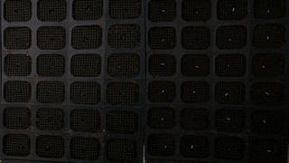
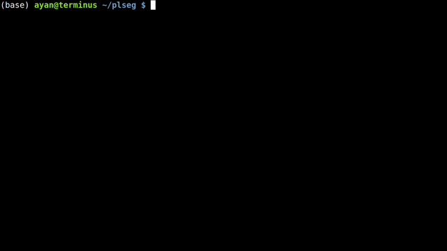

# Plant Segmentation with Graph Cuts



This package implements a graph-cuts based algorithm to segment overhead image sequences of plants, producing a distinct label for each plant that is consistent across the various frames. The package asks users to select a region of interest within which to segment plants—this region is annotated in the first image of the sequence and subsequent images are automatically aligned. Then, the algorithm uses local and pairwise edge-based evidence to perform a segmentation, matching connected components across frames, separating merged components from overlapping plants, and enforcing connectivity within each segmented plant in each frame.

## Setup

We recommend using [Conda](https://www.anaconda.com/download) to setup the environment for this package, using the provided environment setup files to install all required dependencies. Create the `plseg` environment by running:
```
conda env create -f plseg/environment.yml
```
Once the environment is created, remember to "activate" it with:
```
conda activate plseg
```

<i>Note: If you installed the environment for a previous release of this package, you may need to repeat this step. Either remove the old plseg environment and recreate it, or use `conda env update`.</i>

## Workflow

We assume every sequence is stored in its own sub-directory as a set of PNG or JPEG files, which we sort by filename to construct the sequence. All images are assumed to be taken by the same camera at the same resolution with possibly some camera translation between frames.

### 1. Interactively marking ROI


Our UI for specifying ROIs, scale, skip, etc. runs as a Flask web-app. Run this as:
``` shell
conda activate plseg
./plroi.py --port 8888 /path/to/source/base /path/to/target/base
```
The command line arguments above specify the **base** source and target directories---i.e., segmentation outputs of a source sequence stored in `/path/to/source/base/seqname` will be stored in the target `/path/to/target/base/seqname` sub-directory. If your data is stored on a remote machine, you can run it remotely with SSH port-forwarding, e.g.,
``` shell
ssh -L 8888:localhost:8888 username@server.edu
cd /path/to/code
conda activate plseg
./plroi.py --port 8888 /path/to/source/base /path/to/target/base
```
Access the UI by going to `http://127.0.0.1:8888/` in your browser. Note that anyone with localhost network access to either of these two machines will be able to also access the UI, so be sure to secure these machines as necessary.


When you access the UI, you will be able to pick a source sequence sub-directory, or cycle through them with the previous and next buttons. For each sequence, specify the number of frames to _skip_ at the beginning of each sequence, and a _scale_ factor as percentage of the original size. Then, click and drag on the image to select a bounding box for the ROI on the shown first image of the sequence (after any skips). The ROI for subsequent frames will be automatically detected during segmentation. Once you're done, click on **Save** to store these parameters as a JSON file in the corresponding target sub-directory (which will be created if necessary). Repeat this process for different sequence sub-directories.

**Important:** If you plan on running the UI on a different machine than the one in which you will run the segmentation script in the next step below, it is important that the full path to the source base directory be the same on both machines  (if you are running the UI through SSH forwarding, paths on the server you are SSH-ing into should be the same as those on which the segmentation script will be run).

### 2. Segmentation



Next, use the `plabel.py` script to perform the actual segmentation. Activate the `plseg` conda environment, and then call the `plabel.py` script with the target directory path of a sequence. You can also execute `plabel.py` from a job script (remember to activate the right conda environment inside the job script).

For every image in the source sequence (after the skipped initial frames), the script will generate two corresponding image files: one named `-crop` showing the cropped ROI (as tracked across frames), and the other `-seg` visualizating the segmentation. The script alsos create a file called `labels.npz`, that can be loaded in python using `labels = numpy.load('labels.npz')['labels']`. This will be an `H x W x N` integer matrix, where `H` and `W` are the height and width of each cropped image, and `N` the number of frames. Each segmented plant in the sequence will have a positive integer ID, with values in `labels` set to that ID for identified pixels across all frames. Background pixels will be set to zero.

The segmentation will run with default parameters for the graph-cuts formulation. You may optionally modify these parameters by creating a JSON file in the target sub-directories. See our documentation on [Specifying Segmentation Parameters](SEGOPT.md).

### 3. Interactive Clean-up 


As an optional final stage, you can mark plants that were incorrectly segmented in a sequence using another Flask based UI. Run the `plclean.py` with the name of the base target directory, either locally or with SSH forwarding. You will then be able to step through the different segmentation results, and mark labels to leave out of the segmentation. Note that marking a plant in any one frame marks it in all frames in the sequence. Select plans to remove by drawing bounding boxes, which will toggle the deletion status of any label included in the box in that image.

Clicking **Save** will create a new file `clean.npz` in each sub-directory, which will contain a variable `removed` listing the IDs that were removed from the segmentation in `labels.npz`, and a new `labels` variable with only the labels that were not marked for removal (with new plant IDs from from 1 to the number of remaining plants). Once you are done marking all volumes, you can optionally run the script `vizcseg.py` with the base target directory as argument, that visualizes the cleaned up segmentations by creating corresponding image files tagged with `-cseg` in their names.

### 4. Deletion Tool


The deletion tool can be used to discard sections of the segmentation that you may not want to focus on. For example, if you want to obtain the subsection of the plants before they bloom. Call `pldeletion.py` with the name of the base target directory. The usage is similar to the Interactive Cleanup tool, except the selected labels will only be eliminated from the selected frame onwards. Clicking **Save** will create the file `bloom-time.npz`. The new `labels` variable will omit the discarded section of each label. Furthermore, the `bloom-time` variable is an array in which `array[<label name>]=<selected frame number>` for the deleted labels, and `array[<label name>]=-1` if the label was not modified. 

Additional command-line options extend the functionality of this tool. 

* `--input` (default `cleanup`) the name of the `.npz` file to use as input (use `labels` if the cleanup tool was not used)
* `--name` (default `bloom-time`) the name of the `.npz` file to produce
* `--type` (default `1`) defines the type of deletion to make when the user clicks a plant label it may be any of the following:
  * `1` deletes the plant label from the current image onwards
  * `2` deletes the plant label from the first image to the current image
  * `3` deletes the plant label only at the current frame


## LICENSE

[MIT License](LICENSE)

## Acknowledgments

This work was supported by the National Science Foundation under award no. [EF-1921728](https://nsf.gov/awardsearch/showAward?AWD_ID=1921728). Any opinions, findings, and conclusions or recommendations expressed in this material are those of the authors, and do not necessarily reflect the views of the National Science Foundation.
